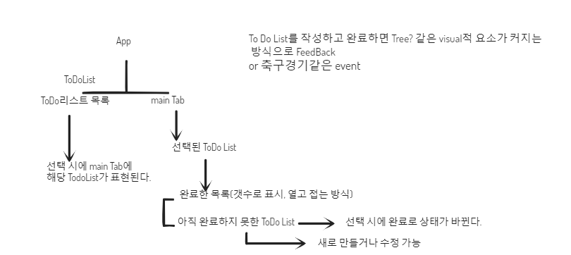
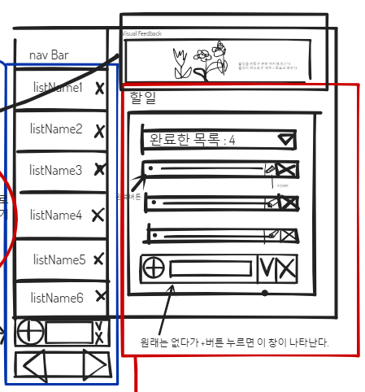
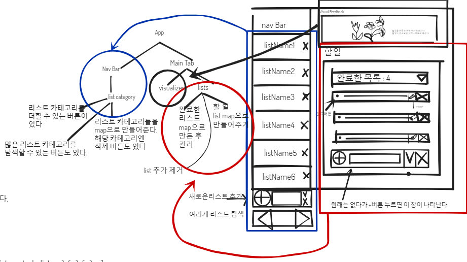
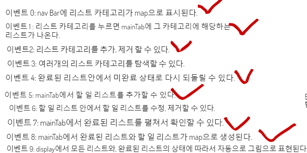
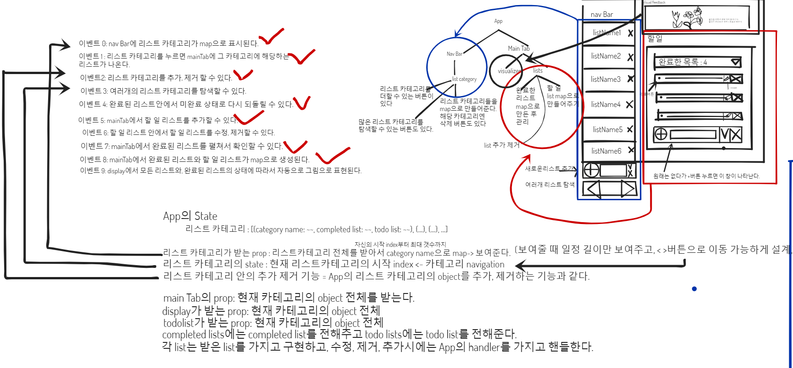

# React_ToDoList
## React로 만들어본 ToDo리스트입니다.
### 디자인은 아직 입히지 않았고 **기능만 먼저 구현**하려고 합니다. 
### **Nav기능을 편하게 만드는 것**에 주로 관심을 쏟았습니다.
### 또한 **React의 setState method를 최적화**해서 **최소한의 state만 변경하면서 각 level에 필요한 기능을 구현**하기 위해서 노력했습니다.
#### 최상단의 App은 
#### 1. TodoList의 각 주제들을 포함하는 Nav에게는 카테고리 Obj를 생성, 삭제, 카테고리 선택의 능력을 부여했고
#### 2. 한 주제의 구체적인 표현인 TodoList, CompletedList을 담당하는 MainTab에게는 해당 카테고리Obj를 변경할 수 있는 능력을 부여했습니다.
### Nav는 **navigation을 중심으로 각 handler함수들을 구체화**한 자신만의 handler함수를 새로 정의해서 사용했고
### MainTab에서는 
### 1. TodoList의 추가, 삭제
### 2. CompletedList의 추가, 삭제 
### 3. TodoList->Complete 
### 4. CompletedList->undo->TodoList
### 기능을 구현하기 위해서 App의 state를 변경하긴 하지만, **App이 제공한 해당 카테고리Obj변경 함수를 사용**해서 **각 기능에 해당하는 newCategoryObj를 정의**하는 식으로 효율적으로 기능을 구현했습니다.
### app에서 category list, todo list, completed list의 **한 페이지상 표현범위가 정해지지 않는다면** 
### **많은 list가 생기는 경우 페이지를 벗어나는 문제**가 생길 수 있어서 **nav기능으로 한 페이지에 일정 수의 list만 넣고**, prev page, next page 버튼, 현재 페이지 정보를 표현해서 해결하는 방식에 초점을 맞췄습니다.
### **nav기능이 세번이나 중복**되다 보니, 처음에는 그냥 구현했지만 library를 만드는 것이 좋을 것 같아서 **한 library로 정리**하려고 합니다. 나중에 또 **nav기능이 필요한 경우, 지금 구현한 library를 사용**할 수 있을 것입니다.

#### 아래는 맨 처음의 설계와 data structure 정의, component diagram입니다.

## **맨 처음 설계**

## **인터페이스 설계**

## **component hierarchy 설계**

## **가능한 이벤트 정의**

## **state와 props로 datastructure 설계 handler정의**
